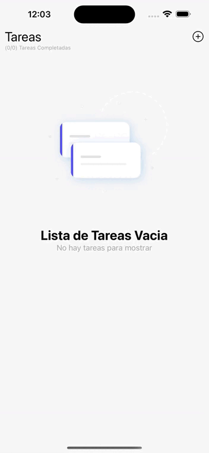

# TaskTrack

### [English Documentation](./README.md)

### Para comenzar a desarrollar con React Native, necesitarás configurar tu entorno de desarrollo. Sigue las instrucciones en la [documentación oficial de React Native](https://reactnative.dev/docs/environment-setup) para configurar tu entorno de desarrollo.

## Instalación y ejecución del proyecto de la lista de tareas

Aquí están las instrucciones necesarias para clonar, instalar y ejecutar el proyecto.

### Paso 1: Clonar el repositorio

Primero, debes clonar el repositorio desde GitHub. Abre tu terminal e ingresa el siguiente comando:

```bash
git clone https://github.com/EriickChavez/rntodolist.git
```

### Paso 2: Navegar al directorio

Después de clonar el repositorio, navega al directorio del proyecto con el siguiente comando:

```bash
cd rntodolist
```

### Paso 3: Instalar las dependencias

Al estar dentro del directorio del proyecto, puedes instalar las dependencias con el siguiente comando:

```bash
yarn install
```

### Paso 3.1: Instalar pods en caso de ios

En caso de ios, primero debes instalar la pods con el siguiente comando:

```bash
npx pod-install
```

o si prefieres, puedes usar el comando

```bash
cd ios && pod install && cd ..
```

### Paso 4: Ejecutar la aplicación

Una vez que todas las dependencias están instaladas, puedes ejecutar el proyecto.

### Paso 4.1: Ejecutar Metro

```bash
yarn start
```

Si estás desarrollando en un Mac y quieres ejecutar la aplicación en un simulador de iOS, puedes usar el siguiente comando:

```bash
react-native run-ios --simulator="iPhone 15 Pro Max"
```

Si prefieres ejecutar la aplicación en un dispositivo o emulador Android, puedes usar el siguiente comando:

```bash
react-native run-android
```

### En caso de tener problemas con android

Puedes ejecutar el comando `adb reverse tcp:8081 tcp:8081` para que la aplicación se pueda acceder desde el dispositivo.

---

### Descripción

Esta es una aplicación de lista de tareas que permite a los usuarios agregar, marcar como completadas y eliminar tareas.
Esta aplicación cuenta con soporte para los idiomas inglés y español.


### Puede Agregar/Editar tareas



### Puede Editar tareas


### Puede marcar como completadas


### Puede eliminar tareas


