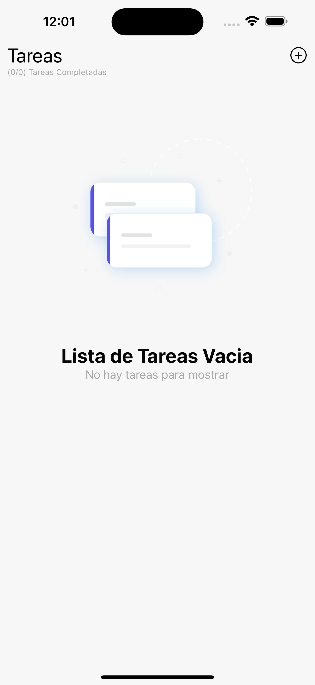
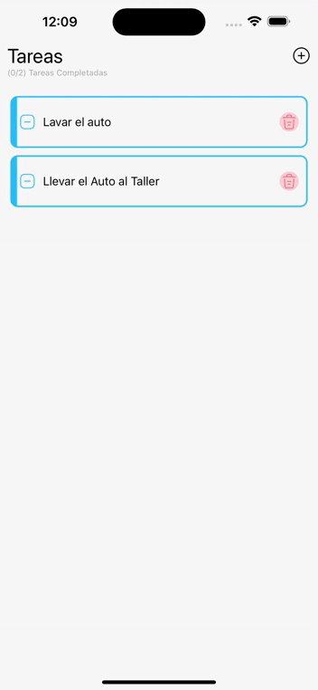
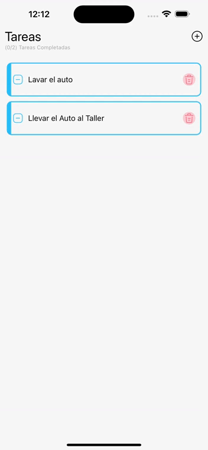

# TaskTrack

### [Spanish Documentation](./README.es.md)

---

### Description

This is a to-do list application that allows users to add, mark as complete, and delete tasks.
This application provides support for both English and Spanish languages.




### Users Can Add/Edit Tasks


### Users Can Edit Tasks


Users Can Mark Tasks as Completed



Users Can Delete Tasks



---

### To start developing with React Native, you'll need to set up your development environment. Follow the instructions in the [official React Native documentation](https://reactnative.dev/docs/environment-setup) to configure your development environment

## Installation and Execution of the To-Do List Project

Here are the necessary instructions for cloning, installing, and running the project.

### Step 1: Clone the Repository

First, you need to clone the repository from GitHub. Open your terminal and enter the following command:

```bash
git clone https://github.com/EriickChavez/rntodolist.git
```

### Step 2: Navigate to the Directory

After cloning the repository, navigate to the project directory with the following command:

```bash
cd rntodolist
```

### Step 3: Install Dependencies

While inside the project directory, you can install the dependencies with the following command:

```bash
yarn install
```

### Step 3.1: Install Pods for iOS (if applicable)

For iOS, you must first install the pods using the following command:

```bash
npx pod-install
```

Alternatively, you can use the following command:

```bash
cd ios && pod install && cd ..
```

### Step 4: Run the Application

Once all dependencies are installed, you can run the project.

### Step 4.1: Run Metro

```bash
yarn start
```

If you are developing on a Mac and want to run the application in an iOS simulator you can use the following command:

```bash
react-native run-ios --simulator="iPhone 15 Pro Max"
```

If you prefer to run the application on an Android device or emulator, you can use the following command:

```bash
react-native run-android
```

If you encounter issues with Android
You can execute the command adb reverse tcp:8081 tcp:8081 to ensure that the application can be accessed from the device.
